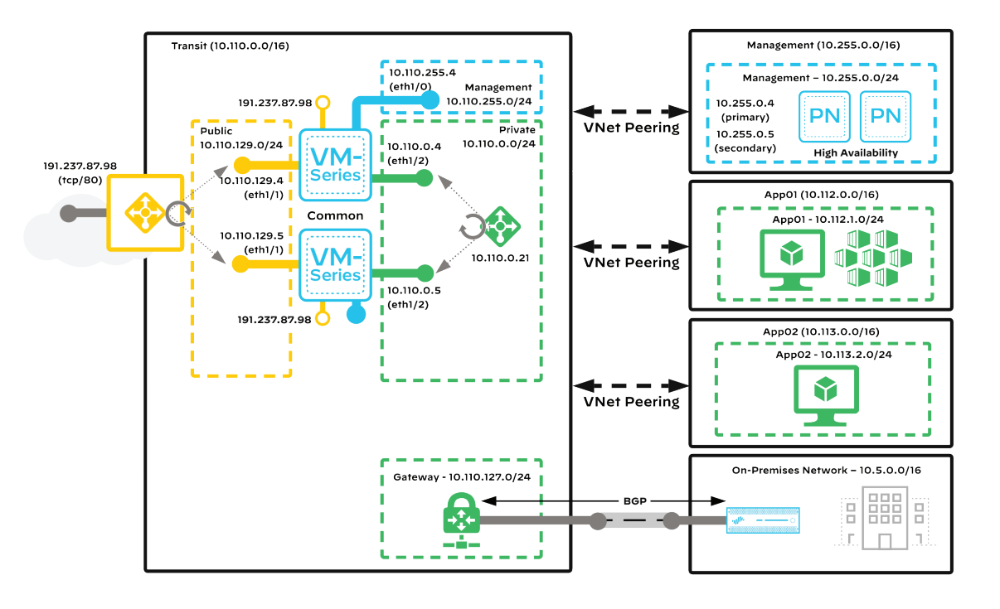

# Architecture
### Overview

### Components
| Component | Type | Description |
|--|--|--|
| **GitHub Repo** | - | The application code and Infrastructure-as-Code (Terraform) is stored here. |
| **GitHub Workflows** | - | GitHub Workflows is being used for CI/CD pipelines. |
| **Terraform Cloud** | - | Terraform Cloud runs the Terraform deployments and stores state. |

## Continue to [Chapter 2](chapter2.md) (Accounts & Tools)