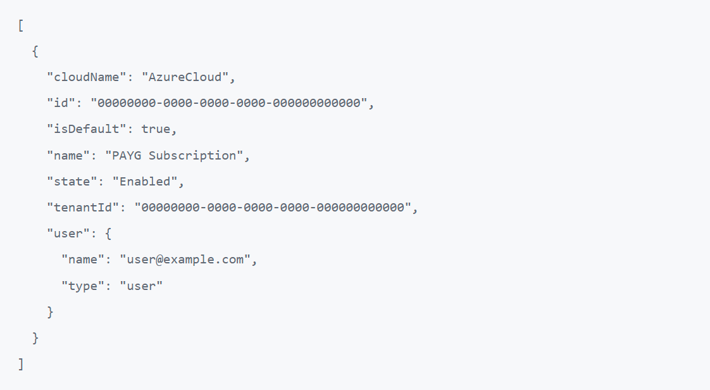
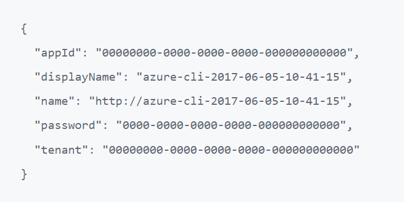

# 2. Accounts & Tools
### a. Accounts
You will need several accounts to complete the deployment.

| Service | Notes |
|--|--|
| GitHub | If you don't already have a GitHub account, you can sign up here: https://github.com/join<br /> |
| Microsoft Azure | We are assuming you already have a Microsoft Azure organization created and have a user account with the correct level of permissions provisioned. |
| Terraform Cloud | If you don't already have a Terraform Cloud account, you can sign up here: https://app.terraform.io/public/signup/account<br /> |

After you have successfully completed setting up your GitHub and Terraform Cloud accounts (or if you already them created), you can continue to the next step.

### b. Tools
- [ ] **Install Azure CLI**
	* https://docs.microsoft.com/en-us/cli/azure/install-azure-cli-windows?tabs=azure-powershell
 - [ ] **Install VS Code**
	* https://code.visualstudio.com/download
 - [ ] **Install the VS Code GitHub Extension**
	* [Install Extension](vscode:extension/GitHub.vscode-pull-request-github), or go here:
	* https://marketplace.visualstudio.com/items?itemName=GitHub.vscode-pull-request-github
 - [ ] **Install the VS Code Terraform Extension**
	* [Install Extension](vscode:extension/hashicorp.terraform), or go here:
	* https://marketplace.visualstudio.com/items?itemName=HashiCorp.terraform
 - [ ] **Install Git**
	* https://git-scm.com/download/win
	* After installing, run these commands in a terminal (PowerShell or cmd.exe):
		```
		git config --global user.name "John Doe"
		git config --global user.email john@doe.com
		git config --global credential.helper wincred
		```
	*(be sure to replace the values with your name and email!)*


### c. Sign VS Code into GitHub
 - [ ] Open VS Code
 - [ ] Select the GitHub Extension (GitHub icon [Octocat] on the left of the window)
 - [ ] Hit the *Sign In* button and follow the prompts

### d. Clone the Template Repos (SKIP THIS STEP IF ANOTHER ORGANIZATION MEMBER HAS ALREADY CLONED THE SOURCE REPOS INTO YOUR ORG)
 - [ ] There are 4 separate repos that are responsible for the entire deployment of the proposed infrastructure.  You may not need either the Foundation or Management repos if you have already deployed the components they are responsible for (for instance, you have an already established Azure Organization or an on-premise Panorama instance).
 - [ ] Go to each of these template repos and follow the next set of instructions for each:
 	* https://github.com/ae-business-solutions/Azure-PANW-CommonFW-Foundation
	* https://github.com/ae-business-solutions/Azure-PANW-CommonFW-Management
	* https://github.com/ae-business-solutions/Azure-PANW-CommonFW-Infrastructure
	* https://github.com/ae-business-solutions/Azure-PANW-CommonFW-Utility
 - [ ] Press the `Use this template` button
 - [ ] Fill in a name and description for your repository
	* *Reminder: you should create the repo in your organization account if you have one; this can be selected in the drop down menu in front of the repo name)*
 - [ ] Review the contents of the template repository

### e. Local Development Setup
 - [ ] Perform the following steps for each of the repos that you cloned above.
 - [ ] Open VS Code (open a new instance of VS Code for each repo that was cloned)
 - [ ] Press Ctrl+Shift+P; you should see a text field pop up at the top of VS Code
 - [ ] Type 'Git' and select 'Git: Clone' from the dropdown
 - [ ] Select 'Clone from GitHub from the dropdown
 - [ ] Select the repository that you created in the last section from the dropdown.
 - [ ] You will be prompted to choose a location to store the repo files
 - [ ] A prompt will appear at the bottom right of VS Code asking you whether you want to open this repository in the current window (choose this one) or a new window
 - [ ] If you select the files tab (the top tab) on the left of VS Code you should see the repository files; you can click any file to open it in the editor on the right
 - [ ] Take a minute to explore the VS Code UI and the repository you just cloned

 ### f. Get your Azure Service Principal
 We will need an Azure Service Principal to give Terraform Cloud access to your Azure environment.  Skip this step if someone has already created a Service Principal with the required permissions for this deployment.  This process is highlighted [here](https://registry.terraform.io/providers/hashicorp/azurerm/latest/docs/guides/service_principal_client_secret).  We'll be creating the Service Principal via the Azure CLI, but you can follow the steps in the linked article if you prefer the Azure Portal (or you can't install the Azure CLI).

 - [ ] Open up a `PowerShell` window.  Login to Azure with `az login`.
 - [ ] A tab will open up in your browser of choice.  Login to Azure with your preferred user credentials.
 - [ ] In PowerShell, type `az account list` and you should get a list of Azure subscriptions that your account has access to.  They'll appear in this form:

 

 - [ ] If you have more than one subscription listed, you'll want to use the command `az account set --subscription="SUBSCRIPTION_ID"` (substituting the appropriate value for `SUBSCRIPTION_ID`).
 - [ ] To create the Service Principal, run the following command:  `az ad sp create-for-rbac --role="Contributor" --scopes="/subscriptions/SUBSCRIPTION_ID"`, replacing SUBSCRIPTION_ID with the correct value.
 - [ ] Assuming you have the correct permissions, the command should return 4 or 5 values:



 - [ ] Set these values aside temporarily for the next chapter! We will refer to these as your Azure Service Principal account parameters from here on out.

 ### g. Accept the Azure Legal Terms for Palo Alto Networks VMs
Microsoft requires that you accept Terms of Service (`Legal Terms`) in order to use the Palo Alto Networks VM images from the Marketplace.

 - [ ] In your PowerShell window, run the following command:  `az vm image terms accept --urn publisher:offer:sku:version`, replacing `publisher:offer:sku:version` with the following:
 	* `paloaltonetworks:vmseries-flex:byol:10.2.3` - This accepts the Terms of Service for the VM-Series firewalls.  (**Note: 10.2.3 was the latest Marketplace version at time of publication.  You'll want to patch the VM-Series NGFWs up to the PANW TAC recommended version post-deployment.**)
	* `paloaltonetworks:panorama:byol:10.2.3` - Also run the command with this value if you're going to deploy Panorama in Azure (**Note: 10.2.3 was the latest Marketplace version at time of publication.  You'll want to patch Panorama up to the PANW TAC recommended version.**)
	* `erockyenterprisesoftwarefoundationinc1653071250513:rockylinux:free:8.7.0` - We leverage Rocky Linux 8.7.0 (a derivative of RHEL) for some of our helper virtual machines.

 - [ ] Go ahead and close your PowerShell window.

 ## Continue to [Chapter 3](chapter3.md) (GitHub Actions (CI/CD))