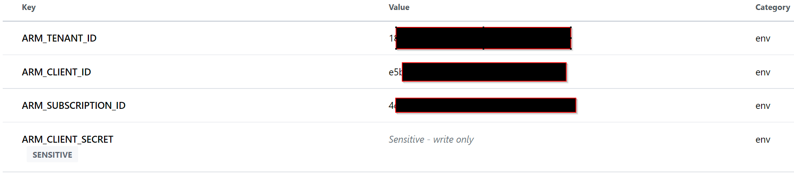

# 3. GitHub Actions


**Please read GitHubs introduction to Actions [here](https://docs.github.com/en/actions/learn-github-actions/introduction-to-github-actions).** It provides an quick overview of what Actions is, what it can do, and how it works. You will be using Actions to orchestrate building and deploying all the applications and infrastructure in this project.

### Prepare Terraform Cloud
First, you'll need to create new Terraform Workspace for each of the repositories you cloned.  We align one Workspace per Repo so that we can independently control permissions to a particular stage of the deployment as well as the triggering of each deployment stage.

 - [ ] Login to the Terraform Cloud web interface.
 - [ ] If you have not done so already, create a new Organization.
 - [ ] Select your `Organization` from the drop down menu at the upper left, and then choose the `Workspaces` tab if it isn't already selected.
 - [ ] For each of the project stages you plan to deploy (Foundation, Management, Infrastructure, Utility), click `New workspace` in the upper right corner.
 - [ ] As we will be integrating our Terraform Cloud Workspace(s) with Github, select `API-driven workflow`.
 - [ ] Give your Workspace an appropriate Name (ex. "Azure-Foundation") and an optional description and then click `Create workspace`.
 - [ ] For each Workspace, go into the `Variables` tab after creation.
	* You will see two sections: `Terraform Variables` and `Environment Variables`.
	* `Terraform Variables` are the inputs to our Terraform configuration.
	* `Environment Variables` can be used to store credentials and other things that Terraform needs to run.
 - [ ] **Optional** Instead of creating your variables in each individual Workspace, create them as a **Variable Set** in Terraform Cloud so you don't have to re-create them (and manage variables individually) in each Workspace.
 - [ ] Remember those values that were the output of the Azure CLI command we used to create our Service Principal?  We'll be creating an `Environment Variable` for the 4 values required to authenticate Terraform Cloud to Azure with our Service Principal.  The 4 values we'll be using are:  `ARM_CLIENT_ID` (derived from the `appID` output of our command), `ARM_CLIENT_SECRET` (derived from the `password` value), `ARM_SUBSCRIPTION_ID` (which should be set to the subscription ID we created the Service Principal in), and `ARM_TENANT_ID` (derived from the `tenant` value).  For each of those 4 variables, perform the following steps:
	* Click `Add variable`.  Select `Environment variable`.
	* The `Key` will be the `ARM_XXXXX` variable name (such as `ARM_CLIENT_ID`).
	* The `Value` will be the appropriate value per the above.
	* `Description` is optional. You *should* check `Sensitive` for `ARM_CLIENT_SECRET` so the client password is write-only and not visible.

 - [ ] We don't want to accidentally leak sensitive data into our repository, such as passwords or auth codes, so we'll store a few sensitive Terraform variables in Terraform Cloud as well.  **You can add these individually to the Management and Infrastructure Workspaces, or create these as an additional Variable Set and assign it to the Management and Infrastructure Workspaces.**
	* There are 4 Terraform variables we'll be adding.  `panorama-serial `, `auth-key`, `admin-user`, and `admin-pass `.
	* Click `Add variable`.  Select `Terraform variable`.
	* The `Key` will be the variable name (such as `panorama-serial`).
	* The `Value` will be the appropriate value (the Serial Number you've pre-generated from the PANW Customer Support Portal for your Panorama instance, a temporary value for the auth-key  we'll provision in Panorama for VM-series bootstrapping (use any value as a placeholder), the initial admin username we want to create in Panorama and our NGFWs, and the password for that admin account).
	* `Description` is optional. You *should* check `Sensitive` for `admin-pass` so the admin password is write-only and not visible.

Your Azure environment variables should look similar to this in each of your Workspaces (or in your Variable Set):



Your Terraform variables should look similar to this in your Management and Infrastructure Workspaces (or in your Variable Set):


Next, you'll need to generate a *Terraform Cloud API Token*.  If you have a Terraform Cloud organization that has a Team enabled Plan, you can create Team API token(s) for individual Teams you may have access to.  If you have a free Plan, you'll create a Team API token in the default `owners` Team.

 - [ ] Go to the Terraform Cloud web interface.
 - [ ] Select your `Organization` from the drop-down menu at the top.
 - [ ] Select the `Settings` tab from the top menu bar (just to the right of Workspaces and Registry).
 - [ ] Select the `Teams` tab on the left.
 - [ ] If you have never generated a Team API token before, you'll see a `Create a team token` button.  If your Team has a previously created API token, you'll see a `Regenerate token` option.
	* Note:  Only select `Regenerate token` if the previously generated token is unknown/unrecoverable.  This will break any other integrations that may be using the old Team API token.
 - [ ] Select the appropriate option.  An API token string will be displayed.  It's a single line that typically has `.atlasv1.` in it.  Copy and paste that someplace temporarily (or store the value in your secrets manager / vault if available!) as we'll be using it in Github shortly.
	* Note:  Once you go away from the screen or close that browser tab, the token will not be displayed again.  If you lose the token, repeat this process again to regenerate it.  The old value will no longer be valid.

Next, we'll need to configure your Terraform Cloud API key in GitHub so our CI/CD pipelines can use it!

 - [ ] We'll repeat this process for each of the repos you cloned earlier (where each individual repo will represent one stage of our CI/CD pipeline).
 - [ ] Go to the GitHub web interface and browse to your repository
 - [ ] Go to the `Settings` tab
 - [ ] Select `Secrets` (at the bottom on the left menu) and then `Actions`.
 - [ ] Press `New repository secret`
 - [ ] Call your secret `TF_API_TOKEN`
 - [ ] Paste the API Token that you generated in the previous section into the `Value` field; be sure to get rid of any extraneous spaces (before or after the token)

### VS Code
For the rest of this chapter we are going to be working in VS Code. You can add folders & files with the file browser on the left, and edit those files with the editor on the right. At the end of this section we will `commit` (save) our changes and then `push` (upload) our commit to GitHub.

### Setup GitHub Actions
GitHub Actions receives the instructions for the its CI/CD pipelines from YAML files contained in your repository. The YAML files are stored in a special folder in the repository.

 - [ ] Create a folder called **.github** in the root of your repository (these may have already been created for you)
 - [ ] Create a folder called **workflows** inside that folder (this may have already been created for you as well)

GitHub Actions has the concept of *workflows*, which are individual CI/CD pipelines. Each workflow is defined as a single YAML (.yml) file in the workflows folder. When you create a YAML file defining a workflow in that folder, GitHub automatically detects it and will show your new workflow on the *Actions* tab in the GitHub web interface.

For this project we are going to be creating 4 *workflows*: 1 each for the organizational "foundation" configuration, 1 for the Panorama management deployment, 1 to deploy all of the infrastructure components and 1 for some of the utility VMs we may use for testing. If they have not been created already for you, go ahead and create the YAML files for those 4 workflows (place each folder and YAML file in its appropriate VS Code / Repo configuration):

 - [ ] foundation.yml
 - [ ] management.yml
 - [ ] infrastructure.yml
 - [ ] utility.yml

> **Tip:** Be very careful about indentation when writing YAML -- it matters!
> **Tip:** Anything following a '#' in a YAML file is a *comment*. You will see many comments in the code blocks below to explain the various components.

#### Foundation
Let's get the Foundation workflow built out.

 - [ ] For the rest of this section, you should be adding all the YAML you see to your `foundation.yml` file!
 - [ ] First, let's add a name for our workflow
	```yaml
	name: Foundation
	```
 - [ ] Next, we will add a trigger for our workflow
	```yaml
	on:
    workflow_dispatch:
	  push:
	    branches: [ main ]
	    paths:
	    - 'foundation/**'
	  pull_request:
	    paths:
	    - 'foundation/**'
	```
The *on:* statement indicates the start of a *trigger* definition -- defining when to run this workflow. In this case we trigger the pipeline in two cases, 1. when new code is pushed to the *main* branch of the repository, and 2. when a *pull request* is created (more on this later). Additionally we further scope it to only apply when changes are specifically made to files within the *foundation* folder; no need to run our foundation pipeline for changes that are not to our foundation!

 - [ ] Now we will add a *job* to this workflow; this is where we actually start telling our workflow to *do stuff*
	```yaml
	jobs:
	  deploy: # Job identifier; can be used to reference this job
	    name: Deploy # Display name for the job
	    runs-on: ubuntu-latest # We want this job to execute on an Ubuntu Linux machine

	    steps: # Each action that our pipeline takes will be defined as a step
	    - name: Checkout # Our first step is to checkout our code!
	      uses: actions/checkout@v2
	```

 - [ ] Let's add our next step; be sure to indent it to the same depth as the previous step
	```yaml
	    - name: Setup Terraform # Name of the step
	      uses: hashicorp/setup-terraform@v1 # Name of the Action to use
	      with: # Parameters for the Action
	        cli_config_credentials_token: ${{ secrets.TF_API_TOKEN }}
	```
In this step we use a pre-made action from the **GitHub Marketplace**. Go ahead and take a quick look at the marketplace [here](https://github.com/marketplace?type=actions). The *setup-terraform* action downloads the current version of Terraform to the *build agent* (where the pipeline is running) and configures it. Note that we are also providing some credentials to Terraform -- these are sourced from the GitHub *secret* that you configured before. These will be used by Terraform when connecting to your Terraform Cloud Workspace.

 - [ ] Time to do something with Terraform now that we have it configured!
	```yaml
	    - name: Terraform Format
	      id: fmt
	      working-directory: ./foundation
	      run: terraform fmt -check
	      continue-on-error: true

	    - name: Terraform Init
	      id: init
	      working-directory: ./foundation
	      run: terraform init

	    - name: Terraform Plan
	      id: plan
	      if: github.event_name == 'pull_request'
	      working-directory: ./foundation
	      run: terraform plan -no-color
	      continue-on-error: true
	```
With these three steps, we do three things:
1. Run the Terraform format checker against our Terraform code (to make sure it's formatted correctly!)
2. Initialize Terraform. This downloads any needed Terraform *providers*. Providers are used to interact with third-party services, such as GCP, AWS, or Azure.
3. Tell Terraform to create a *Plan*. One of the best features of Terraform is that it can analyze your code and your infrastructure, determine the differences between them, and tell you exactly what it is going to do (create, modify, delete) before doing it!

This next one is a beast, bear with us.

 - [ ] Here we do some magic: using the *github-script* Action we take our Terraform Plan and document it in our pull request for review; this way we can review the Foundation change plan before deciding if we want to apply it!
	```yaml
	    - uses: actions/github-script@0.9.0
	      if: github.event_name == 'pull_request'
	      env:
	        PLAN: "terraform\n${{ steps.plan.outputs.stdout }}"
	      with:
	        github-token: ${{ secrets.GITHUB_TOKEN }}
	        script: |
	          const output = `#### Terraform Format and Style 泱圭`${{ steps.fmt.outcome }}\`
	          #### Terraform Initialization 笞呻ｸ十`${{ steps.init.outcome }}\`
	          #### Terraform Plan 沒暴`${{ steps.plan.outcome }}\`
	          <details>
	          <summary>Show Plan</summary>
	          \`\`\`
	          ${process.env.PLAN}
	          \`\`\`
	          </details>
	          
	          **Pusher: \`@${{ github.actor }}\`, Action: \`${{ github.event_name }}\`**`;
	            
	          github.issues.createComment({
	            issue_number: context.issue.number,
	            owner: context.repo.owner,
	            repo: context.repo.repo,
	            body: output
	          })
	```

 - [ ] This is to exit our pipeline if our Terraform plan fails (there is some issue with our code)
	```yaml
	    - name: Terraform Plan Status
	      if: steps.plan.outcome == 'failure'
	      run: exit 1
        
      - name: Checkov
        if: github.event_name == 'pull_request'
        id: checkov
        uses: bridgecrewio/checkov-action@master
        with:
          directory: ./foundation
          quiet: true
          framework: terraform
          output_format: github_failed_only
          soft_fail: true 
	```

 - [ ] We'll also run a code validation tool called Checkov (formerly a BridgeCrew project, but now a part of Palo Alto Networks!) against our Terraform code.

 - [ ] Lastly, we check to see if this was triggered by a pull request being merged into our *main* branch; if it is, we can proceed with a Terraform *Apply* to actually make the changes we planned and reviewed!
	```yaml
	    - name: Terraform Apply
	      working-directory: ./foundation
	      if: github.ref == 'refs/heads/main' && github.event_name == 'push'
	      run: terraform apply -auto-approve
	```

If you want to read more about automating Terraform with GitHub Actions in more depth, check out HashiCorp's guide [here](https://learn.hashicorp.com/tutorials/terraform/github-actions?in=terraform/automation).

<details>
  <summary>Click here to see a complete copy of foundation.yml</summary>
  
```yaml
# GitHub Workflow to build the Azure Foundation Infrastructure
name: Foundation

# Only run this Workflow for pull requests on branches or pushes to 'main'.
# Limited to commits that make changes to the foundation directory in the repo.
on:
  workflow_dispatch:
  push:
    branches: [ main ]
    paths:
    - 'foundation/**'
  pull_request:
    paths:
    - 'foundation/**'

jobs:
  deploy:
    name: Deploy
    runs-on: ubuntu-latest

    steps:
    - name: Checkout
      uses: actions/checkout@v2

    - name: Setup Terraform
      uses: hashicorp/setup-terraform@v1
      with:
        cli_config_credentials_token: ${{ secrets.TF_API_TOKEN }}

    - name: Terraform Format
      id: fmt
      working-directory: ./foundation
      run: terraform fmt -check
      continue-on-error: true

    - name: Terraform Init
      id: init
      working-directory: ./foundation
      run: terraform init

    - name: Terraform Plan
      id: plan
      if: github.event_name == 'pull_request'
      working-directory: ./foundation
      run: terraform plan -no-color
      continue-on-error: true

    - uses: actions/github-script@0.9.0
      if: github.event_name == 'pull_request'
      env:
        PLAN: "terraform\n${{ steps.plan.outputs.stdout }}"
      with:
        github-token: ${{ secrets.GITHUB_TOKEN }}
        script: |
          const output = `#### Terraform Format and Style 泱圭`${{ steps.fmt.outcome }}\`
          #### Terraform Initialization 笞呻ｸ十`${{ steps.init.outcome }}\`
          #### Terraform Plan 沒暴`${{ steps.plan.outcome }}\`
          <details>
          <summary>Show Plan</summary>
          \`\`\`
          ${process.env.PLAN}
          \`\`\`
          </details>
          
          **Pusher: \`@${{ github.actor }}\`, Action: \`${{ github.event_name }}\`**`;
            
          github.issues.createComment({
            issue_number: context.issue.number,
            owner: context.repo.owner,
            repo: context.repo.repo,
            body: output
          })

    - name: Terraform Plan Status
      if: steps.plan.outcome == 'failure'
      run: exit 1
 
    - name: Checkov
      if: github.event_name == 'pull_request'
      id: checkov
      uses: bridgecrewio/checkov-action@master
      with:
        directory: ./foundation
        quiet: true
        framework: terraform
        output_format: github_failed_only
        soft_fail: true

    - name: Terraform Apply
      working-directory: ./foundation
      if: github.ref == 'refs/heads/main' && github.event_name == 'push'
      run: terraform apply -auto-approve
```
</details>
*(your file should look like this!)*

### Panorama and Management VNET
As you may recall from the architecture overview, we build out a dedicated Shared Services VNET for common services such as Panorama.  We require a Panorama management VM in order to bootstrap our Palo Alto Networks NGFWs. In this section we are going to write a GitHub Workflow that deploys the shared services Management VNET and subnets, and then bootstrap in our Panorama VM.

 - [ ] For the rest of this section, you should be adding all the YAML you see to your `management.yml` file!  Note that this file may have already been created for you.
 - [ ] The configuration for this workflow is identical to the Foundation workflow, so we'll combine all of our individual steps into one to save some time.
```yaml
name: Management

# Only run this Workflow for pull requests on branches or pushes to 'main'.
# Limited to commits that make changes to the panorama directory in the repo.
on:
  workflow_dispatch:
  push:
    branches: [ main ]
    paths:
    - 'management/**'
  pull_request:
    paths:
    - 'management/**'

jobs:
  deploy:
    name: Deploy
    runs-on: ubuntu-latest

    steps:
    - name: Checkout
      uses: actions/checkout@v2

    - name: Setup Terraform
      uses: hashicorp/setup-terraform@v1
      with:
        cli_config_credentials_token: ${{ secrets.TF_API_TOKEN }}

    - name: Terraform Format
      id: fmt
      working-directory: ./management
      run: terraform fmt -check
      continue-on-error: true

    - name: Terraform Init
      id: init
      working-directory: ./management
      run: terraform init

    - name: Terraform Plan
      id: plan
      if: github.event_name == 'pull_request'
      working-directory: ./management
      run: terraform plan -no-color
      continue-on-error: true

    - uses: actions/github-script@0.9.0
      if: github.event_name == 'pull_request'
      env:
        PLAN: "terraform\n${{ steps.plan.outputs.stdout }}"
      with:
        github-token: ${{ secrets.GITHUB_TOKEN }}
        script: |
          const output = `#### Terraform Format and Style 泱圭`${{ steps.fmt.outcome }}\`
          #### Terraform Initialization 笞呻ｸ十`${{ steps.init.outcome }}\`
          #### Terraform Plan 沒暴`${{ steps.plan.outcome }}\`
          <details>
          <summary>Show Plan</summary>
          \`\`\`
          ${process.env.PLAN}
          \`\`\`
          </details>
          
          **Pusher: \`@${{ github.actor }}\`, Action: \`${{ github.event_name }}\`**`;
            
          github.issues.createComment({
            issue_number: context.issue.number,
            owner: context.repo.owner,
            repo: context.repo.repo,
            body: output
          })

    - name: Terraform Plan Status
      if: steps.plan.outcome == 'failure'
      run: exit 1

    - name: Checkov
      if: github.event_name == 'pull_request'
      id: checkov
      uses: bridgecrewio/checkov-action@master
      with:
        directory: ./foundation
        quiet: true
        framework: terraform
        output_format: github_failed_only
        soft_fail: true

    - name: Terraform Apply
      working-directory: ./management
      if: github.ref == 'refs/heads/main' && github.event_name == 'push'
      run: terraform apply -auto-approve
```

### Infrastructure
The majority of our deployment occurs in this stage.  In this section we are going to write a GitHub Workflow that deploys our public and private VNET, the management VNET for our NGFWs management interfaces, ingress and egress load balancers, routing and Azure network firewall ACLs, and finally we'll bootstrap in our Palo Alto Networks Next Generation Firewall VMs.

 - [ ] For the rest of this section, you should be adding all the YAML you see to your `infrastructure.yml` file!  Note that this file may have already been created for you.
 - [ ] The configuration for this workflow is identical to the Foundation workflow, so we'll combine all of our individual steps into one to save some time.
```yaml
# GitHub Workflow to build the Azure NGFW/ILB Infrastructure
name: Infrastructure

# Only run this Workflow for pull requests on branches or pushes to 'main'.
# Limited to commits that make changes to the infrastructure directory in the repo.
on:
  workflow_dispatch:
  push:
    branches: [ main ]
    paths:
    - 'infrastructure/**'
  pull_request:
    paths:
    - 'infrastructure/**'

jobs:
  deploy:
    name: Deploy
    runs-on: ubuntu-latest

    steps:
    - name: Checkout
      uses: actions/checkout@v2

    - name: Setup Terraform
      uses: hashicorp/setup-terraform@v1
      with:
        cli_config_credentials_token: ${{ secrets.TF_API_TOKEN }}

    - name: Terraform Format
      id: fmt
      working-directory: ./infrastructure
      run: terraform fmt -check
      continue-on-error: true

    - name: Terraform Init
      id: init
      working-directory: ./infrastructure
      run: terraform init

    - name: Terraform Plan
      id: plan
      if: github.event_name == 'pull_request'
      working-directory: ./infrastructure
      run: terraform plan -no-color
      continue-on-error: true

    - uses: actions/github-script@0.9.0
      if: github.event_name == 'pull_request'
      env:
        PLAN: "terraform\n${{ steps.plan.outputs.stdout }}"
      with:
        github-token: ${{ secrets.GITHUB_TOKEN }}
        script: |
          const output = `#### Terraform Format and Style 泱圭`${{ steps.fmt.outcome }}\`
          #### Terraform Initialization 笞呻ｸ十`${{ steps.init.outcome }}\`
          #### Terraform Plan 沒暴`${{ steps.plan.outcome }}\`
          <details>
          <summary>Show Plan</summary>
          \`\`\`
          ${process.env.PLAN}
          \`\`\`
          </details>
          
          **Pusher: \`@${{ github.actor }}\`, Action: \`${{ github.event_name }}\`**`;
            
          github.issues.createComment({
            issue_number: context.issue.number,
            owner: context.repo.owner,
            repo: context.repo.repo,
            body: output
          })

    - name: Terraform Plan Status
      if: steps.plan.outcome == 'failure'
      run: exit 1

    - name: Checkov
      if: github.event_name == 'pull_request'
      id: checkov
      uses: bridgecrewio/checkov-action@master
      with:
        directory: ./foundation
        quiet: true
        framework: terraform
        output_format: github_failed_only
        soft_fail: true

    - name: Terraform Apply
      working-directory: ./infrastructure
      if: github.ref == 'refs/heads/main' && github.event_name == 'push'
      run: terraform apply -auto-approve
```

### Utility
Finally, we use this stage to deploy several Azure Virtual Machines for testing and diagnostics.  We'll also deploy 2 Virtual Machines to act as backend webservers to show our environment is working.

 - [ ] For the rest of this section, you should be adding all the YAML you see to your `utility.yml` file!  Note that this file may have already been created for you.
 - [ ] The configuration for this workflow is identical to the Foundation workflow, so we'll combine all of our individual steps into one to save some time.
```yaml
# GitHub Workflow to build the Azure Utility VM Infrastructure
name: Utility

# Only run this Workflow for pull requests on branches or pushes to 'main'.
# Limited to commits that make changes to the Utility directory in the repo.
on:
  workflow_dispatch:
  push:
    branches: [ main ]
    paths:
    - 'utility/**'
  pull_request:
    paths:
    - 'utility/**'

jobs:
  deploy:
    name: Deploy
    runs-on: ubuntu-latest

    steps:
    - name: Checkout
      uses: actions/checkout@v2

    - name: Setup Terraform
      uses: hashicorp/setup-terraform@v1
      with:
        cli_config_credentials_token: ${{ secrets.TF_API_TOKEN }}

    - name: Terraform Format
      id: fmt
      working-directory: ./utility
      run: terraform fmt -check
      continue-on-error: true

    - name: Terraform Init
      id: init
      working-directory: ./utility
      run: terraform init

    - name: Terraform Plan
      id: plan
      if: github.event_name == 'pull_request'
      working-directory: ./utility
      run: terraform plan -no-color
      continue-on-error: true

    - uses: actions/github-script@0.9.0
      if: github.event_name == 'pull_request'
      env:
        PLAN: "terraform\n${{ steps.plan.outputs.stdout }}"
      with:
        github-token: ${{ secrets.GITHUB_TOKEN }}
        script: |
          const output = `#### Terraform Format and Style 泱圭`${{ steps.fmt.outcome }}\`
          #### Terraform Initialization 笞呻ｸ十`${{ steps.init.outcome }}\`
          #### Terraform Plan 沒暴`${{ steps.plan.outcome }}\`
          <details>
          <summary>Show Plan</summary>
          \`\`\`
          ${process.env.PLAN}
          \`\`\`
          </details>
          
          **Pusher: \`@${{ github.actor }}\`, Action: \`${{ github.event_name }}\`**`;
            
          github.issues.createComment({
            issue_number: context.issue.number,
            owner: context.repo.owner,
            repo: context.repo.repo,
            body: output
          })

    - name: Terraform Plan Status
      if: steps.plan.outcome == 'failure'
      run: exit 1

    - name: Checkov
      if: github.event_name == 'pull_request'
      id: checkov
      uses: bridgecrewio/checkov-action@master
      with:
        directory: ./foundation
        quiet: true
        framework: terraform
        output_format: github_failed_only
        soft_fail: true

    - name: Terraform Apply
      working-directory: ./utility
      if: github.ref == 'refs/heads/main' && github.event_name == 'push'
      run: terraform apply -auto-approve
```


### Commit & Push Our Changes!
At last we will `commit` (save) our changes and then `push` (upload) our commit to GitHub.  It's possible you will have no changes if the Github Actions were already created for you.


 - [ ] Be sure you have saved changes to all your files before continuing! (there is a `Save All` option in the `File` menu to make it easy, or make sure Auto Save is enabled!)
 - [ ] Go to the *Git* tab in VS Code (see screenshot).
 - [ ] Press the `+` next to the word *Changes* to add all changed files to your commit.
 - [ ] Fill in a *commit message* in the text box near the top.
 - [ ] Press the *check* button at the top to complete your commit.


 - [ ] Lastly, use the `Synchronize Changes` button (circle with arrows) to `push` our `commit` to GitHub. The 0 indicates that there are 0 new changes from GitHub to `pull` (*download*), and 1 new change to `push` (*upload*).

In the next Chapter, we'll modify several Terraform variables that are specific to your Azure environment and finally deploy all of our stages!

## Continue to [Chapter 4](chapter4.md) (Terraform: Azure Foundation)