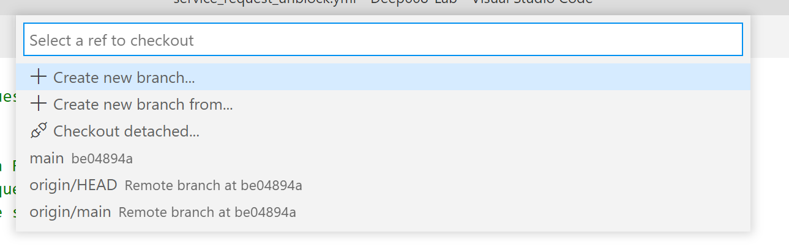
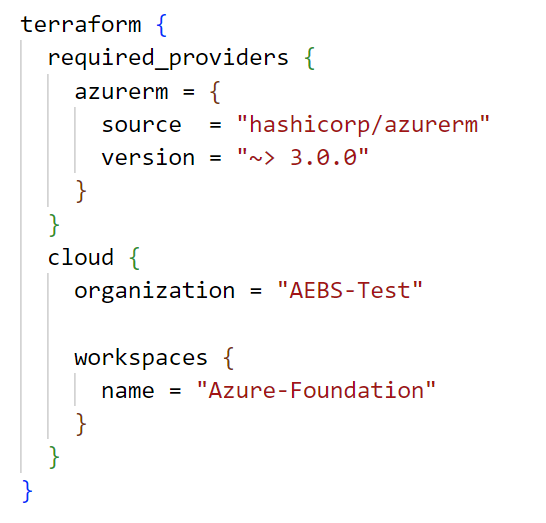
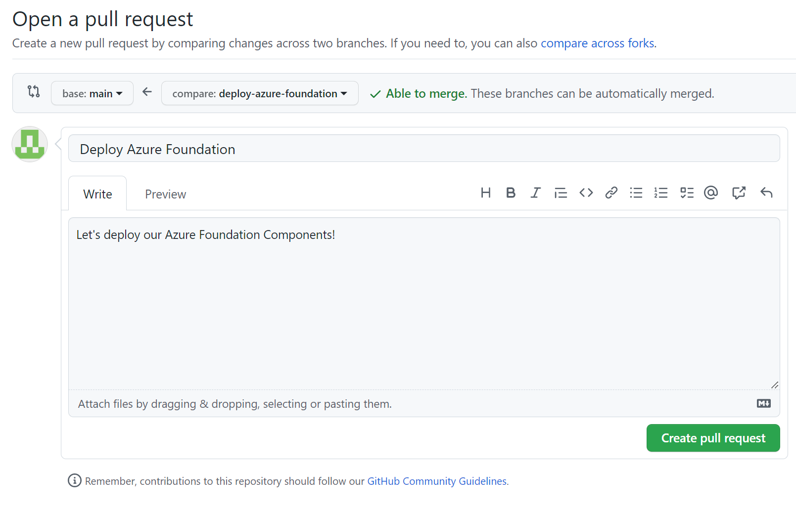

# 4. Terraform: Azure
### Terraform Overview
Terraform is a tool for building, changing, and versioning infrastructure safely and efficiently. Terraform is an Infrastructure-as-Code (IaC) tool: we can design our infrastructure in a text-based configuration language and then commit those configurations to the same Git repository as the code for our app.

Configuration files describe to Terraform the components needed to run a single application or your entire datacenter (or cloud). Terraform generates an execution plan describing what it will do to reach the desired state, and then executes it to build the described infrastructure. As the configuration changes, Terraform is able to determine what changed and create incremental execution plans which can be applied.

The infrastructure Terraform can manage includes low-level components such as compute instances, storage, and networking, as well as high-level components such as DNS entries, SaaS features, etc.

In this project, we will be using Terraform to deploy all our infrastructure, as well as configure much of that infrastructure.

### Create a Git `Branch`
We are going to create a new Git `branch` to work from. It is a best practice to avoid commiting directly to your `main` branch as we did in the last chapter. The high level process looks like this:

1. Create a branch (often called a *feature* branch for net-new code or a *bugfix* branch for a... bugfix).
2. Make your changes in your branch.
3. Commit & push your changes.
4. Create a `pull request` in GitHub. A `pull request` is a construct on GitHub wherein you are requesting that code in a `branch` be 'pulled' into the `main` branch. This request is an opportunity to review and test the code before moving it into our `main` branch. In *Chapter 3*, we added some code to our GitHub Actions Workflow to automatically run a `terraform plan` and document it in our pull request; this means that we are going to get to preview our infrastructure changes in our pull request before executing them!

We're going to perform these steps for each of our 4 deployment stages in sequence (`Foundation`, `Management`, `Infrastructure` and finally `Utility`).

Let's get started.

### Deploy our Foundation stage

 - [ ] In your `Foundation` VS Code instance, press on the `main` button at the bottom left of your VS Code interface; a menu will open the top of your screen.
 - [ ] Select `+ Create new branch...` and then enter a branch name (ex: `deploy-azure-foundation`).
 - [ ] You should now see your new branch name at the bottom left of your VS Code interface, indicating that you have switched from the `main` branch to your new branch. You can always click the branch button to open the dropdown from the previous step, which allows switching between branches in addition to creating new ones.

### Basic Setup & Variables
There are two Terraform configurations that have already been provided for you in the repository template: `main.tf` and `variables.tf`. Let's take a moment to review them.

`main.tf` contains the basic settings for Terraform. This includes what version of the Terraform tool we want to use, and where we want to store our Terraform `state`. State is how we track what our infrastructure looks like: every time terraform makes changes, it documents the composition of the infrastructure in its state. Out of the box, Terraform will store state in a local file; for this deployment we are using Terraform Cloud to store our state centrally. This configuration block tells Terraform about our Terraform Cloud Workspace.

 - [ ] You'll need to replace `organization` in main.tf with your Terraform Cloud organization name.
 - [ ] You'll also need to replace the `name` value under `workspaces`.  See below for the exact spot for each of these:
 

The `variables.tf` defines variables that we will use in our Terraform configurations. This makes Terraform configurations more modular and reusable (and prevents us having to copy/paste a lot!). `locals` are fixed variables that are local to to this Terraform configuration, whereas `variables` are variables that can be provided as *input* when applying this configuration. This gives us the ability to provide dynamic input when the configuration is applied.

You'll notice one additional file called `terraform.tfvars`.  We can leverage a variable definition file (signified by the `.tfvars` suffix) to define the value for variables that were defined in variables.tf or main.tf.  As a formatting standard for this deployment, we will keep all variable definitions inside `variables.tf` and all variable values in `terraform.tfvars`.

- [ ] You'll need to set several values specific to your Azure environment.

| Variable | Description |
|--|--|
| **azure-region** | Set this to the Azure region you want to deploy into (ex. `westus2`) |
| **resource-group-name** | Set this to the name of the test Resource Group you want created as part of our deployment validation. |
| **default-tags** | Set this to any tags we want applied to our test Resource Group.  This takes the form of key / value pairs. |

### Azure Provider
Terraform has the concept of `provider`. A provider is essentially an importable module that enables / adds support for a third-party service to Terraform. In this case we are using the Azure Resource Manager provider to add the ability to create Azure resources to Terraform. You can review Terraform's provider *registry* [here](https://registry.terraform.io/browse/providers) to see a list of services you could configure with Terraform.  You can see documentation for the Azure Resource Manager Terraform provider [here](https://registry.terraform.io/providers/hashicorp/azurerm/latest/docs).

You can get complete examples and detailed documentation of all the available attributes for any resource on the Terraform documentation site. In this project, you will see a link to the relevant resource documentation for each resource that we deploy in the comment above the resource configuration.

That's it! When we run Terraform in our GitHub Actions CI/CD pipeline later, the configuration you just modified will deploy our Foundational resources!

### `Commit` & `Push`!
Our work here is done, let's save our changes and create some resources!

 - [ ] Be sure to save all the files you edited.
 - [ ] Commit your changes. See the end of [Chapter 3](chapter3.md) for a reminder on how to do that.
 - [ ] Push your changes. You will notice that the synchronize button now looks like a cloud with an up arrow: this is to tell you that you are pushing a new branch to GitHub (and not just changes to an existing branch).

### Your First Pull Request
Now we are going to create a `pull request` to get the changes in our branch into the `main` branch. You can ignore the pop-up in VS Code about creating a Pull Request (if there is one).  Let's switchover to the GitHub web interface.

 - [ ] Go to the `Pull requests` tab.
 - [ ] You should see a `Compare & pull request` button referencing the branch you just pushed.
 - [ ] You will be asked to provide a title and comment for your pull request. Also note that at the bottom of the page it shows you a `diff` of the changes you made: the difference between the files in your branch, and the `main` branch.  Click `Create pull request`.
 - [ ] Now some magic happens: remember that pull request trigger we added to our Workflow? Go to the `Actions` tab and you should see a Workflow run in progress for your new pull request. Click on it to watch the progress as Terraform creates a plan for the infrastructure changes.
 - [ ] Once the Workflow run completes successfully, return to your pull request. If it doesn't complete successfully, we will need to troubleshoot before proceeding further.
 - [ ] Review the comment that has been added to your pull request by the Workflow. You can see all the details of Terraform's plan for building your infrastructure
 - [ ] If everything looks good... go ahead and hit `Merge pull request` followed by `Confirm merge`! This will move your code into the `main` branch and kickoff your Workflow again -- this time to actually build the infrastructure, not just `plan` it.
 - [ ] You will be prompted to delete your branch -- go ahead and do so, we are done with it.
 - [ ] Now go back to the `Actions` tab and open the Workflow run that is in progress to watch Terraform do its work! If the Workflow does not complete successfully (green check), we will need to troubleshoot.

If you like, you can now log into the Azure console and review the test Resource Group you just created in the console web UI. 

Before you go...

 - [ ] Go back to VS Code.
 - [ ] Press the `branch` button at the bottom left of VS Code and select the `main` branch from the dropdown.
 - [ ] Press the synchronize button to pull down the changes we just made to the `main` branch.
 - [ ] To clean-up your locally stored branch:
	* Click on `Source Control` (or hit Ctrl+Shift+G)
	* Click the triple dots in the Source Control panel in the upper right and choose `Branch` and then `Delete Branch`.
	* Select your local branch (`deploy-azure-foundation` in our example).
	* Done!

Now we'll repeat a similar process for our 3 other stages!

## Continue to [Chapter 5](chapter5.md) (Terraform: Azure Management)