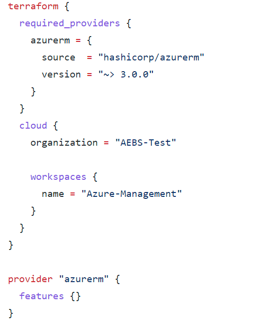
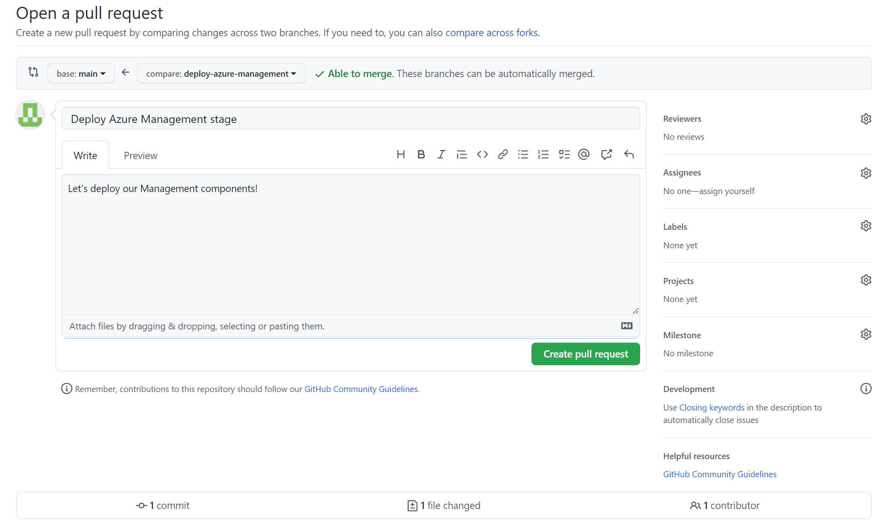
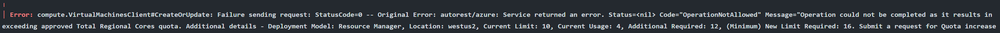
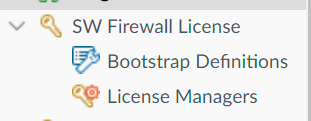
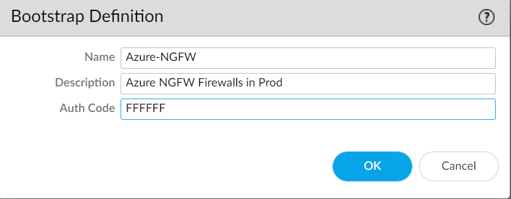
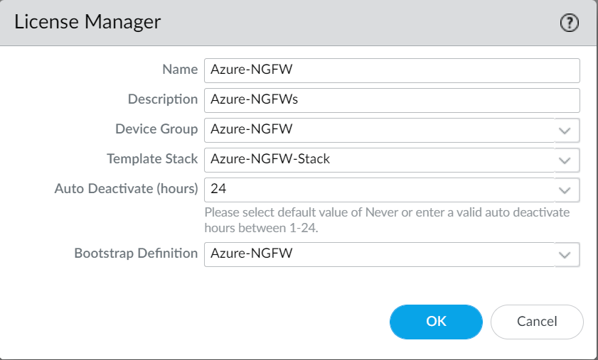

# 5. Terraform: Azure Management
### Deploy our Management stage

 - [ ] In your `Management` VS Code instance, press on the `main` button at the bottom left of your VS Code interface; a menu will open the top of your screen.
 - [ ] Select `+ Create new branch...` and then enter a branch name (ex: `deploy-azure-management`).
 - [ ] You should now see your new branch name at the bottom left of your VS Code interface, indicating that you have switched from the `main` branch to your new branch. You can always click the branch button to open the dropdown from the previous step, which allows switching between branches in addition to creating new ones.

### Basic Setup & Variables
Similar to our Foundation stage, there are two Terraform configurations that have already been provided for you in the repository template: `main.tf` and `variables.tf`. 

 - [ ] You'll need to replace `organization` in main.tf with your Terraform Cloud organization name.
 - [ ] You'll also need to replace the `name` value under `workspaces`.  This should be a different Terraform Cloud Workspace than the one you used for your Foundation stage.  See below for the exact spot for each of these:
 

Similar to Foundation, you'll notice a file called `terraform.tfvars`.  We can leverage a variable definition file (signified by the `.tfvars` suffix) to define the value for variables that were defined in variables.tf or main.tf.  As a formatting standard for this deployment, we will keep all variable definitions inside `variables.tf` and all variable values in `terraform.tfvars`.

- [ ] You'll need to set several values specific to your Azure environment.

| Variable | Description |
|--|--|
| **azure-region** | Set this to the Azure region you want to deploy into (ex. `westus2`)|
| **mgmt-prefix** | Prefix for the shared services management Resource Group name.|
| **default-tags** | Set this to any tags we want applied to our test Resource Group.  This takes the form of key / value pairs. |
| **mgmt-supernet** | A list of CIDR block(s) for the management VNET.|
| **mgmt-management-subnet** | The subnet of the mgmt-supernet that contains management resources.|
| **transit-public-subnet** | The subnet of the transit-supernet that contains public resources. |
| **transit-private-subnet** | The subnet of the transit-supernet that contains private resources. |
| **management-external** | External source subnets that are allowed to connect to the management VNET.|
| **management-internal** | Internal source subnets that are allowed to connect to the management VNET.|
| **panorama-ip** | Set this to the static IP address of your Panorama's management interface.|

### `Commit` & `Push`!
Our work here is done, let's save our changes and create some resources!

 - [ ] Be sure to save all the files you edited.
 - [ ] Commit your changes. See the end of [Chapter 3](chapter3.md) for a reminder on how to do that.
 - [ ] Push your changes. You will notice that the synchronize button now looks like a cloud with an up arrow: this is to tell you that you are pushing a new branch to GitHub (and not just changes to an existing branch).

### Management Pull Request
Now we are going to create a `pull request` to get the changes in our branch into the `main` branch. You can ignore the pop-up in VS Code about creating a Pull Request (if there is one).  Let's switchover to the GitHub web interface of your Management Repo.

 - [ ] Go to the `Pull requests` tab.
 - [ ] You should see a `Compare & pull request` button referencing the branch you just pushed.
 - [ ] You will be asked to provide a title and comment for your pull request. Also note that at the bottom of the page it shows you a `diff` of the changes you made: the difference between the files in your branch, and the `main` branch.  Click `Create pull request`.
 - [ ] Now some magic happens: remember that pull request trigger we added to our Workflow? Go to the `Actions` tab and you should see a Workflow run in progress for your new pull request. Click on it to watch the progress as Terraform creates a plan for the infrastructure changes.
 - [ ] Once the Workflow run completes successfully, return to your pull request. If it doesn't complete successfully, we will need to troubleshoot before proceeding further.
 - [ ] Review the comment that has been added to your pull request by the Workflow. You can see all the details of Terraform's plan for building your infrastructure
 - [ ] If everything looks good... go ahead and hit `Merge pull request` followed by `Confirm merge`! This will move your code into the `main` branch and kickoff your Workflow again -- this time to actually build the infrastructure, not just `plan` it.
 - [ ] You will be prompted to delete your branch -- go ahead and do so, we are done with it.
 - [ ] Now go back to the `Actions` tab and open the Workflow run that is in progress to watch Terraform do its work! 

And we bet your Workflow did not complete successfully (red check).  Why is that?

You're likely seeing an error like the above in your Workflow.  Panorama deployed in [Panorama Mode](https://docs.paloaltonetworks.com/panorama/10-1/panorama-admin/set-up-panorama/set-up-the-panorama-virtual-appliance/setup-prerequisites-for-the-panorama-virtual-appliance) requires 16 vCPU and 32GB of memory along with at least 2TB of logging disk.  Azure quotas per region for CPU Cores start at 10.

We'll need to request an increase to this subscription's quota.

 - [ ] Search for `Quotas`.  Select `Compute` under the `View and increase my quotas` section.
 - [ ] Select the appropriate Subscription in the Subscription drop-down, and the appropriate Region (`West US 2` in our example).
 - [ ] Select the check-box next to `Total Regional vCPUs` and `Standard Dv2 Family vCPUs` (the VM type we're using for Panorama).
 - [ ] Click on the `Request quota increase` option at the upper left, followed by `Enter a new limit`.
 - [ ] Under both options, enter `24` (that'll give us some extra space to account for other virtual machines we'll be deploying later).  Click `Submit`.
 - [ ] Search for `c2_cpu` in the filter and then scroll down to the region we're building in (`us-central1` in this particular stage).  Select the check box on the left.
 - [ ] Luckily, quota increases in Azure are pretty straightforward.  Most of the quota change requests in Azure are automatically approved.  Within a few minutes, you should receive notification in the Azure Portal that your quota has been increased.
 - [ ] Click `Refresh` in the quota screen and you should see your new effective quotas.

 - [ ] Go back to the `Actions` tab within your Management Repo.  Click back into your failed job if you're not still in it.
 - [ ] In the upper right corner, select `Re-run jobs`, then `Re-run failed jobs`, then one final `Re-run jobs`.  This will re-start your Terraform apply, but only for the resources that were unsuccessful in their deployment!

If you like, you can now log into the Azure Portal and review the Resource Groups, VNETs and Virtual Machines you just created in the console web UI.

### Finish Panorama Configuration

At this point in our deployment, Panorama should be up and reachable via its External IP.
- [ ] Go back to the Azure Portal web console.
- [ ] Search for `Virtual Machines` and select it.
- [ ] You should see 2 VM instances, one called `$mgmt-prefix-mgmt` and one called `$mgmtprefix-panorama-1`.  The second is your Panorama VM.
- [ ] Locate the `External IP` for Panorama, open a new tab in your browser, and navigate to `https://EXTERNAL-IP` (replacing EXTERNAL-IP with the `External IP` of Panorama!)

**Note: We'll be performing several manual steps for this next part.  In the future, we'll add in automations that make this manual process unnecessary.**

- [ ] After accepting the certificate warning, you should be able to login with the user credentials you set earlier in your Terraform Cloud Workspace variables.
- [ ] Click through any warnings about telemetry collection and navigate to the `Panorama` tab at the top.
- [ ] Find the `Plugins` tab on the lower left.
- [ ] In the search bar (next to a small magnifying glass), type in `sw_fw_license` and hit enter.  You'll see several versions of the Software Firewall Plugin.  Find the latest version and click `Download` on the right side.  Click `Close` once the download has completed.
- [ ] Click `Install` on the right side for the sw_fw_license plugin version you downloaded.  Once that's completed, your screen should refresh and you'll see a new tab option on the left that looks like this:

- [ ] Select `Bootstrap Definitions`, then click `Add` at the bottom of the middle window pane.
- [ ] Fill in values for the `Name` (ex. `Azure-NGFW`), `Description`, (ex. `Azure NGFW Firewalls in Prod`), and `Auth Code` (fill in the Software NGFW auth code from your Software NGFW provisioning profile that you previously created).  Click `Ok`.

- [ ] Select `License Managers` under the `SW Firewall License` tab on the left, then click `Add` at the bottom of the middle window pane.
- [ ] Fill in values for the `Name`, `Description`, `Device Group` (ex. `Azure-NGFW` based on the default Device Group that our startup-script creates), `Template Stack` (ex. `Azure-NGFW-Stack` based on the default Template Stack that our startup-script creates), `Auto Deactivate` (ex. `24` or the number of hours before we auto-deactivate offline firewalls), and finally the `Bootstrap Definition` that you just created above.  Click `Ok`.

- [ ] Select `Commit` and then `Commit to Panorama` in the upper right corner, then click `Commit` to commit our changes to Panorama.  Click `Close` when it's complete.
- [ ] Click `Show Bootstrap Parameters` in the middle pane.  You'll want to take note of the `auth-key` value as we'll use it during our next deployment stage.

From here, there are a lot of other things to configure in Panorama to make it production-ready, including loading in a `Day 1 Configuration` and any other configuration standards that you normally follow.  The complete configuration of Panorama is outside of the scope of this stage.

**Note 1: We have loaded in most of the configuration that is required to provide basic functionality with our NGFWs per the reference architecture.**

**Note 2: There is a [feature](https://docs.paloaltonetworks.com/pan-os/10-2/pan-os-new-features/panorama-features/automatic-content-push-for-vm-series-and-cn-series-firewalls) in Panorama >= 10.2.0 that needs to be enabled for bootstrapping to work seemlessly.  This should be completed in your NGFW Template Stack (if it hasn't already been set) before proceeding to the next stage.**

Before you go...

 - [ ] Go back to VS Code.
 - [ ] Press the `branch` button at the bottom left of VS Code and select the `main` branch from the dropdown.
 - [ ] Press the synchronize button to pull down the changes we just made to the `main` branch.
 - [ ] To clean-up your locally stored branch:
	* Click on `Source Control` (or hit Ctrl+Shift+G)
	* Click the triple dots in the Source Control panel in the upper right and choose `Branch` and then `Delete Branch`.
	* Select your local branch (`deploy-azure-management` in our example).
	* Done!

## Continue to [Chapter 6](chapter6.md) (Terraform: Azure Infrastructure)