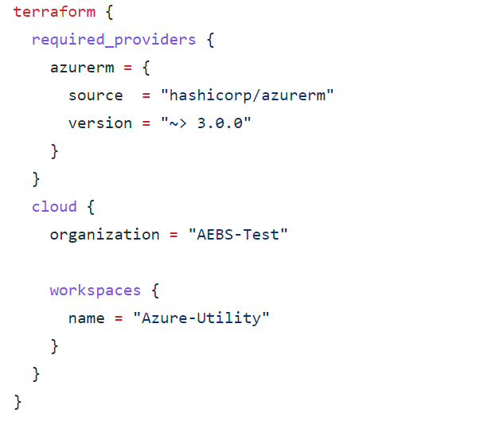
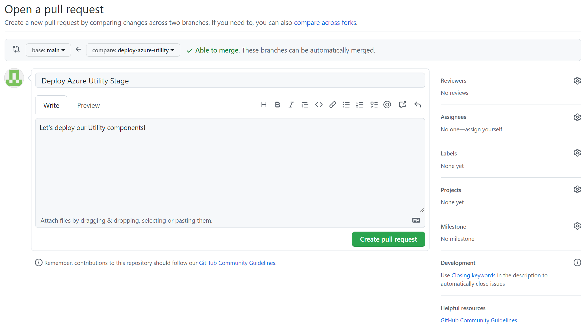

# 6. Terraform: Azure Utility and Beyond
### Deploy our Utility stage

 - [ ] In your `Utility` VS Code instance, press on the `main` button at the bottom left of your VS Code interface; a menu will open the top of your screen.
 - [ ] Select `+ Create new branch...` and then enter a branch name (ex: `deploy-azure-utility`).
 - [ ] You should now see your new branch name at the bottom left of your VS Code interface, indicating that you have switched from the `main` branch to your new branch. You can always click the branch button to open the dropdown from the previous step, which allows switching between branches in addition to creating new ones.

### Basic Setup & Variables
Similar to our Foundation and Management projects, there are two Terraform configurations that have already been provided for you in the repository template: `main.tf` and `variables.tf`. 

 - [ ] You'll need to replace `organization` in main.tf with your Terraform Cloud organization name.
 - [ ] You'll also need to replace the `name` value under `workspaces`.  This should be a different Terraform Cloud Workspace than the one you used for your Foundation stage.  See below for the exact spot for each of these:

 

You'll also notice a file called `terraform.tfvars`.  We can leverage a variable definition file (signified by the `.tfvars` suffix) to define the value for variables that were defined in variables.tf or main.tf.  As a formatting standard for this deployment, we will keep all variable definitions inside `variables.tf` and all variable values in `terraform.tfvars`.

- [ ] You'll need to set several values specific to your Azure environment.

| Variable | Description |
|--|--|
| **azure-region** | Set this to the Azure region you want to deploy into (ex. `westus2`). |
| **transit-prefix** | Prefix for the Transit Resource Group name. |
| **default-tags** | Set this to any tags we want applied to our test Resource Group.  This takes the form of key / value pairs. |
| **vpn-gateway1-bgp-asn** | BGP ASN for our first VPN Gateway. |
| **vpn-gateway1-bgp-peer-ip** | IP address for our first BGP peer. |
| **vpn-gateway1-ip** | IP of our first VPN gateway peer. |
| **vpn-gateway2-bgp-asn** | BGP ASN for our second VPN Gateway. |
| **vpn-gateway2-bgp-peer-ip** | IP address for our second BGP peer. |
| **vpn-gateway2-ip** | IP of our second VPN gateway peer. |

### `Commit` & `Push`!
Our work here is done, let's save our changes and create some resources!

 - [ ] Be sure to save all the files you edited.
 - [ ] Commit your changes. See the end of [Chapter 3](chapter3.md) for a reminder on how to do that.
 - [ ] Push your changes. You will notice that the synchronize button now looks like a cloud with an up arrow: this is to tell you that you are pushing a new branch to GitHub (and not just changes to an existing branch).

### Utility Pull Request
Now we are going to create a `pull request` to get the changes in our branch into the `main` branch. You can ignore the pop-up in VS Code about creating a Pull Request (if there is one).  Let's switchover to the GitHub web interface of your Management Repo.

 - [ ] Go to the `Pull requests` tab.
 - [ ] You should see a `Compare & pull request` button referencing the branch you just pushed.
 - [ ] You will be asked to provide a title and comment for your pull request. Also note that at the bottom of the page it shows you a `diff` of the changes you made: the difference between the files in your branch, and the `main` branch.  Click `Create pull request`.
 - [ ] Now some magic happens: remember that pull request trigger we added to our Workflow? Go to the `Actions` tab and you should see a Workflow run in progress for your new pull request. Click on it to watch the progress as Terraform creates a plan for the infrastructure changes.
 - [ ] Once the Workflow run completes successfully, return to your pull request. If it doesn't complete successfully, we will need to troubleshoot before proceeding further.
 - [ ] Review the comment that has been added to your pull request by the Workflow. You can see all the details of Terraform's plan for building your infrastructure
 - [ ] If everything looks good... go ahead and hit `Merge pull request` followed by `Confirm merge`! This will move your code into the `main` branch and kickoff your Workflow again -- this time to actually build the infrastructure, not just `plan` it.
 - [ ] You will be prompted to delete your branch -- go ahead and do so, we are done with it.
 - [ ] Now go back to the `Actions` tab and open the Workflow run that is in progress to watch Terraform do its work! 

Before you go...

 - [ ] Go back to VS Code.
 - [ ] Press the `branch` button at the bottom left of VS Code and select the `main` branch from the dropdown.
 - [ ] Press the synchronize button to pull down the changes we just made to the `main` branch.
 - [ ] To clean-up your locally stored branch:
	* Click on `Source Control` (or hit Ctrl+Shift+G)
	* Click the triple dots in the Source Control panel in the upper right and choose `Branch` and then `Delete Branch`.
	* Select your local branch (`deploy-azure-utility` in our example).
	* Done!

That's it!